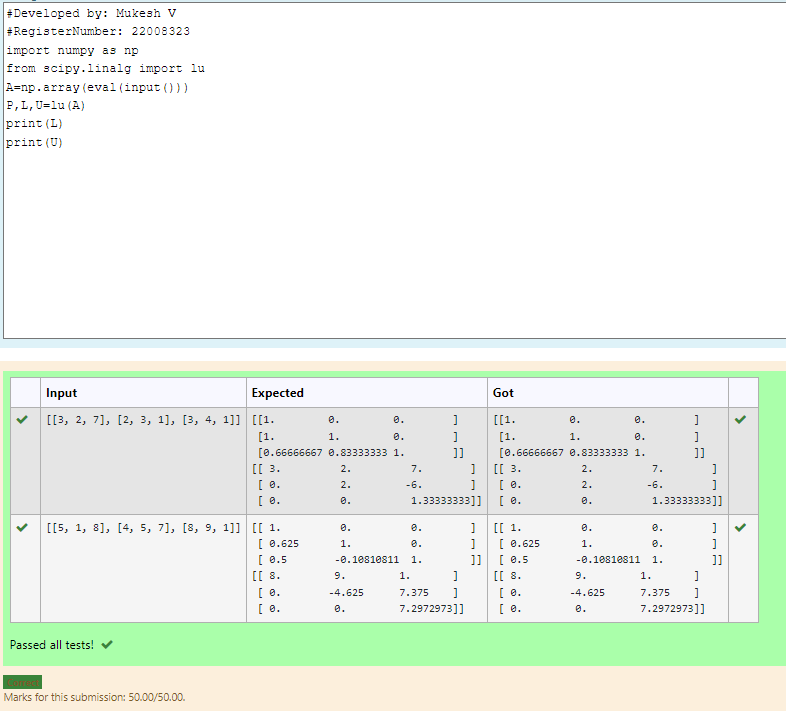

# LU Decomposition 

## AIM:
To write a program to find the LU Decomposition of a matrix.

## Equipments Required:
1. Hardware – PCs
2. Anaconda – Python 3.7 Installation / Moodle-Code Runner

## Algorithm
1. Import the numpy module to use the built-in functions for calculation
2. Prepare the lists of values and assign in np.array() 
3. Use "from scipy.linalg import lu",we can find the L and U of the matirx And Use "from scipy.linalg import lu_factor,lu_solve" we can find the LU decomposition matrix of the matrix 
4. End the program

## Program:
(i) To find the L and U matrix
```
/*
Program to find the L and U matrix.
# Developed by: Mukesh V
# RegisterNumber: 22008323
import numpy as np
from scipy.linalg import lu
A=np.array(eval(input()))
P,L,U=lu(A)
print(L)
print(U)
*/
```
(ii) To find the LU Decomposition of a matrix
```
/*
Program to find the LU Decomposition of a matrix.
# Developed by: Mukesh V
# RegisterNumber: 22008323
import numpy as np
from scipy.linalg import lu_factor,lu_solve
a=np.array(eval(input()))
b=np.array(eval(input()))
lu,piv=lu_factor(a)
x=lu_solve((lu,piv),b)
print (x)
*/
```

## Output:
(i)



(ii)


## Result:
Thus the program to find the LU Decomposition of a matrix is written and verified using python programming.

